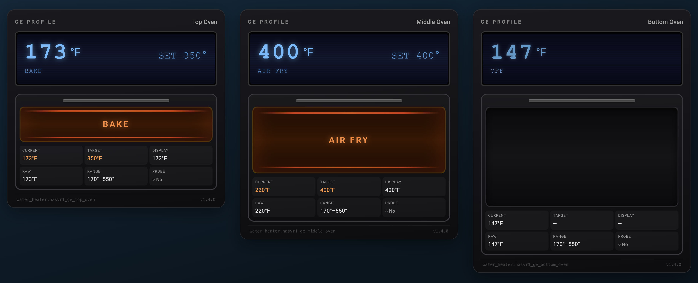

# GE Oven Card

[](https://github.com/hacs/integration)
[](LICENSE)

A custom Lovelace card for Home Assistant that displays a visual status panel for GE Profile ovens connected via the SmartHQ integration.

The card renders a stylized GE Profile oven front panel: a blue LCD display with a CRT scanline effect, an oven door frame with handle and window, animated heat element bars and orange glow when active, a lightbulb indicator, and a compact attribute grid. It supports single ovens, double ovens, and GE TwinFlex triple-cavity configurations.



---

## Features

- Blue LCD display with CRT scanline overlay and large current-temperature readout
- LCD right side cycles through: active cook timer, kitchen timer, or set-point temperature
- Operation mode label (Bake, Broil, Air Fry, Convection Roast, etc.) on the LCD; falls back to `display_state` when the oven is off
- Probe status shown on the LCD when a meat probe is detected; shows actual probe temperature once inserted
- Orange heat glow animation and pulsing heat element bars when the oven is active
- Dark, unlit window when the oven is off
- Lightbulb indicator in the top bar derived from the `select.*_light` entity; glows yellow when on
- Temperature range (`min_temp` / `max_temp`) displayed in the top bar
- Attribute grid inside the door frame: Current temp, Target temp, Probe, Cook Timer, Kitchen Timer, Status
- 100 degrees F treated as a sensor floor value and shown as "--" rather than a false reading
- Three size modes: `normal`, `medium`, `small` for multi-cavity oven dashboards
- All sensor entity IDs are auto-derived from the primary `water_heater` entity ID; no manual sensor configuration required
- Graceful handling of unavailable entities

---

## Prerequisites

- Home Assistant with the **SmartHQ** (GE Home) integration configured and your GE oven discovered
- GE ovens must appear as `water_heater` entities — this is how the SmartHQ integration exposes them
- **HACS** installed, for the recommended installation method

---

## Installation

### Via HACS (Recommended)

1. Open HACS in your Home Assistant sidebar and go to **Frontend**.
2. Click the three-dot menu in the top right and select **Custom repositories**.
3. Add the following URL with category **Lovelace**:
   ```
   https://github.com/ChrisCaho/ge-oven-card
   ```
4. Close the dialog, search for **GE Oven Card**, and install it.
5. Clear your browser cache and reload the Home Assistant UI.

### Bundle Alternative

If you use multiple GE appliance cards (washer, dryer, oven), install the combined bundle instead:

```
https://github.com/ChrisCaho/ge-appliances-card
```

That repository packages all three cards in a single HACS install.

### Manual Installation

1. Download `ge-oven-card.js` from this repository.
2. Copy it to `/config/www/` (create the directory if it does not exist).
3. In Home Assistant go to **Settings > Dashboards > Resources** and add:
   - URL: `/local/ge-oven-card.js`
   - Resource type: **JavaScript module**
4. Reload your browser.

---

## Configuration

Add the card to a Lovelace dashboard using the YAML editor.

### Minimal

```yaml
type: custom:ge-oven-card
entity: water_heater.hasvr1_ge_top_oven
```

### Full Options

```yaml
type: custom:ge-oven-card
entity: water_heater.hasvr1_ge_top_oven
name: "Top Oven"
size: normal
```

### Configuration Reference

| Option   | Type   | Required | Default                   | Description |
|----------|--------|----------|---------------------------|-------------|
| `entity` | string | Yes      | —                         | Entity ID of the `water_heater` entity for the oven cavity |
| `name`   | string | No       | Entity's `friendly_name`  | Display name shown in the top-right of the card |
| `size`   | string | No       | `normal`                  | Card height: `normal`, `medium`, or `small` |

---

## Size Modes

The `size` option controls the height of the oven window. The LCD display and attribute grid are the same across all sizes.

| Size     | Window Height | Card Units | Typical Use |
|----------|---------------|------------|-------------|
| `normal` | 180 px        | 6          | Single oven or primary full-size cavity |
| `medium` | 120 px        | 5          | Secondary cavity in a double oven |
| `small`  | 60 px         | 4          | Third cavity or warming drawer |

### Multi-Cavity Example

```yaml
type: vertical-stack
cards:
  - type: custom:ge-oven-card
    entity: water_heater.hasvr1_ge_top_oven
    name: "Top Oven"
    size: small
  - type: custom:ge-oven-card
    entity: water_heater.hasvr1_ge_middle_oven
    name: "Middle Oven"
    size: medium
  - type: custom:ge-oven-card
    entity: water_heater.hasvr1_ge_bottom_oven
    name: "Bottom Oven"
    size: normal
```

---

## Entity Requirements

### Primary Entity

The card requires one `water_heater` entity. The following attributes are read from it:

| Attribute             | Used For |
|-----------------------|----------|
| `state`               | Determines active/off display state |
| `current_temperature` | LCD temperature readout and attribute grid |
| `temperature`         | Set-point on LCD right side and attribute grid |
| `operation_mode`      | Mode label on LCD and inside oven window |
| `display_state`       | Fallback label shown on LCD when oven is off |
| `display_temperature` | Preferred display temperature for the LCD (takes priority over `current_temperature`) |
| `raw_temperature`     | Alternative temperature reading |
| `probe_present`       | Whether a meat probe is inserted |
| `min_temp`            | Shown in top bar temperature range |
| `max_temp`            | Shown in top bar temperature range |
| `friendly_name`       | Used as the card name if `name` is not set in config |

### Auto-Discovered Entities

The card derives companion entity IDs from the primary entity automatically by replacing the domain prefix and appending a suffix. No configuration is needed. If an entity does not exist the corresponding field shows "--".

Given `water_heater.hasvr1_ge_top_oven`, the card looks for:

| Derived Entity ID                                      | Used For |
|--------------------------------------------------------|----------|
| `sensor.hasvr1_ge_top_oven_cook_time_remaining`        | Cook timer countdown on LCD and in attribute grid |
| `sensor.hasvr1_ge_top_oven_kitchen_timer`              | Kitchen timer countdown on LCD and in attribute grid |
| `sensor.hasvr1_ge_top_oven_probe_display_temp`         | Meat probe temperature in LCD and attribute grid |
| `select.hasvr1_ge_top_oven_light`                      | Oven light on/off state for the lightbulb indicator |

---

## LCD Display Logic

The right-side field of the LCD follows this priority order:

1. If a cook timer is active (`cook_time_remaining` > 0), it shows `COOK Xh Ym`
2. Otherwise, if a kitchen timer is running, it shows `TIMER Xm`
3. Otherwise, if a target temperature is set, it shows `SET XXX°`

The probe line on the lower LCD appears when `probe_present` is `true`. If probe temperature is available it shows `PROBE XXX°F`; otherwise it shows `PROBE`.

---

## Compatibility

- **Integration**: SmartHQ / GE Home (exposes GE ovens as `water_heater` entities)
- **Home Assistant**: 2024.1 and later
- **HACS**: Compatible as a custom repository

---

## License

MIT License. See the [LICENSE](LICENSE) file for details.
