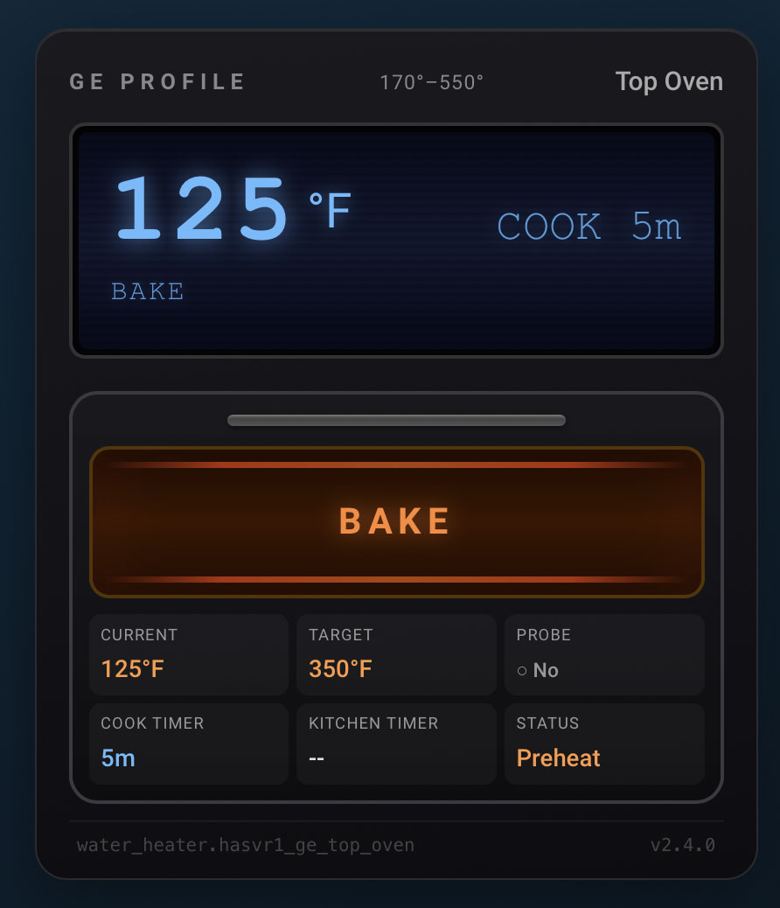
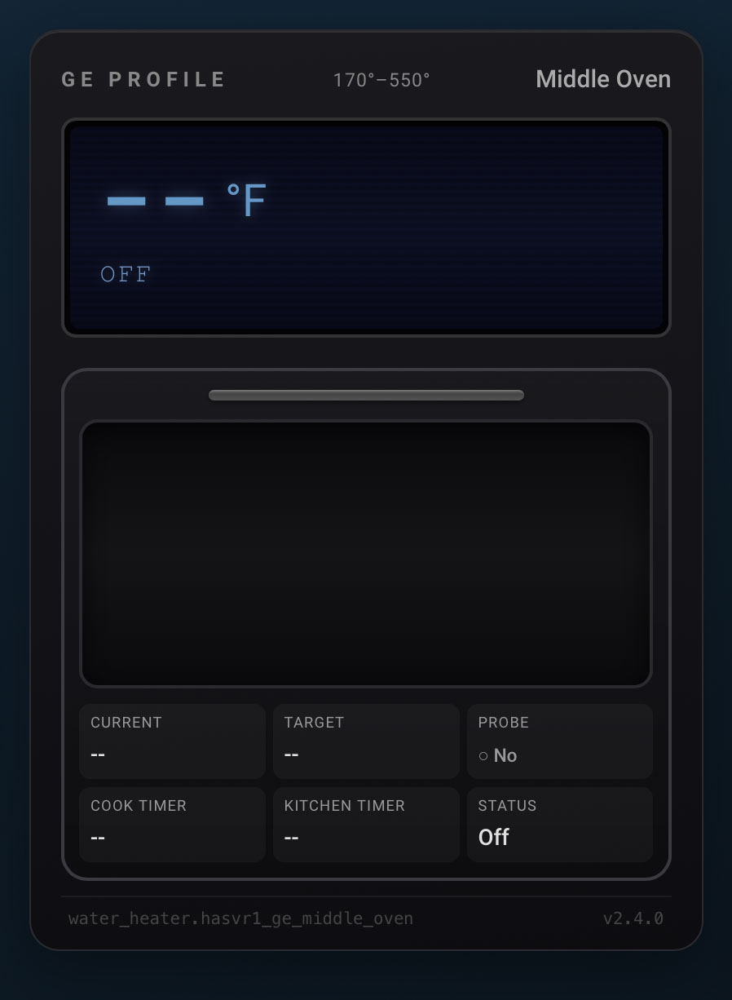
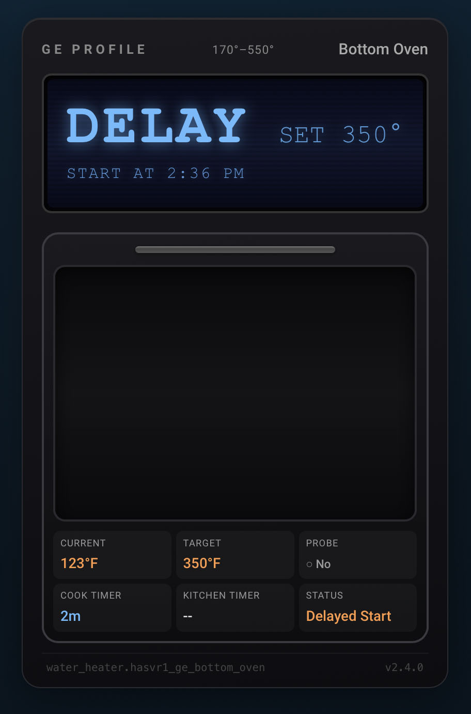
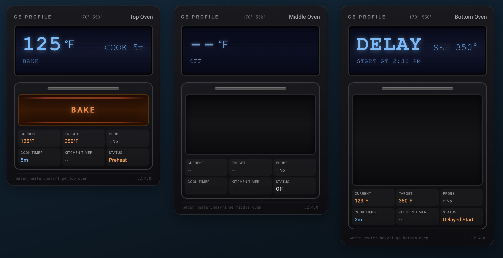

# GE Oven Card

[](https://github.com/hacs/integration)
[](LICENSE)

A custom Lovelace card for Home Assistant that displays a visual status panel for GE Profile ovens connected via the SmartHQ integration.

The card renders a stylized GE Profile oven front panel: a blue LCD display with a CRT scanline effect, an oven door frame with handle and window, animated heat element bars and orange glow when active, a lightbulb indicator, and a compact attribute grid. It supports single ovens, double ovens, and GE TwinFlex triple-cavity configurations.



> **Looking for all GE appliance cards in one package?** Check out [GE Appliances Card](https://github.com/ChrisCaho/ge-appliances-card) — a bundle containing oven, washer, and dryer cards.







---

## Features

- Blue LCD display with CRT scanline overlay and large current-temperature readout
- Delayed start support: LCD shows "DELAY" with countdown timer when a delayed cook is programmed
- LCD right side cycles through: delay countdown, active cook timer, kitchen timer, or set-point temperature
- Operation mode label (Bake, Broil, Air Fry, Convection Roast, etc.) on the LCD; falls back to `display_state` when the oven is off
- Probe status shown on the LCD when a meat probe is detected; shows actual probe temperature once inserted
- Orange heat glow animation and pulsing heat element bars when the oven is active
- Dark, unlit window when the oven is off
- Lightbulb indicator inside the LCD display, only visible when the oven light is on (orange-yellow glow)
- Temperature range (`min_temp` / `max_temp`) displayed in the top bar
- Attribute grid inside the door frame: Current temp, Target temp, Probe, Cook Timer, Kitchen Timer, Elapsed
- Cooking elapsed timer shows time since preheat completed (requires optional helper setup — see [Elapsed Timer Setup](#elapsed-timer-setup-optional))
- Mode-specific heating elements: Bake (bottom only), Broil (top only), Roast (both), Convection modes (with spinning fan)
- Heat wave animations: rising from bottom element, falling from top element, or circulating ovals in convection mode
- LCD mode line shows "MODE - PHASE" during preheat (e.g. "BAKE - PREHEAT"), just the mode name once cooking
- 100 degrees F treated as a sensor floor value and shown as "--" rather than a false reading
- Three size modes: `normal`, `medium`, `small` for multi-cavity oven dashboards
- All sensor entity IDs are auto-derived from the primary `water_heater` entity ID; no manual sensor configuration required
- Graceful handling of unavailable entities

---

## Prerequisites

- Home Assistant with the **SmartHQ** (GE Home) integration configured and your GE oven discovered
- GE ovens must appear as `water_heater` entities — this is how the SmartHQ integration exposes them
- **HACS** installed, for the recommended installation method

---

## Installation

### Via HACS (Recommended)

1. Open HACS in your Home Assistant sidebar and go to **Frontend**.
2. Click the three-dot menu in the top right and select **Custom repositories**.
3. Add the following URL with category **Lovelace**:
   ```
   https://github.com/ChrisCaho/ge-oven-card
   ```
4. Close the dialog, search for **GE Oven Card**, and install it.
5. Clear your browser cache and reload the Home Assistant UI.

### Bundle Alternative

If you use multiple GE appliance cards (washer, dryer, oven), install the combined bundle instead:

```
https://github.com/ChrisCaho/ge-appliances-card
```

That repository packages all three cards in a single HACS install.

### Manual Installation

1. Download `ge-oven-card.js` from this repository.
2. Copy it to `/config/www/` (create the directory if it does not exist).
3. In Home Assistant go to **Settings > Dashboards > Resources** and add:
   - URL: `/local/ge-oven-card.js`
   - Resource type: **JavaScript module**
4. Reload your browser.

---

## Configuration

Add the card to a Lovelace dashboard using the YAML editor.

### Minimal

```yaml
type: custom:ge-oven-card
entity: water_heater.hasvr1_ge_top_oven
```

### Full Options

```yaml
type: custom:ge-oven-card
entity: water_heater.hasvr1_ge_top_oven
name: "Top Oven"
size: normal
```

### Configuration Reference

| Option   | Type   | Required | Default                   | Description |
|----------|--------|----------|---------------------------|-------------|
| `entity` | string | Yes      | —                         | Entity ID of the `water_heater` entity for the oven cavity |
| `name`   | string | No       | Entity's `friendly_name`  | Display name shown in the top-right of the card |
| `size`   | string | No       | `normal`                  | Card height: `normal`, `medium`, or `small` |

---

## Size Modes

The `size` option controls the height of the oven window. The LCD display and attribute grid are the same across all sizes.

| Size     | Window Height | Card Units | Typical Use |
|----------|---------------|------------|-------------|
| `normal` | 180 px        | 6          | Single oven or primary full-size cavity |
| `medium` | 120 px        | 5          | Secondary cavity in a double oven |
| `small`  | 60 px         | 4          | Third cavity or warming drawer |

### Multi-Cavity Example

```yaml
type: vertical-stack
cards:
  - type: custom:ge-oven-card
    entity: water_heater.hasvr1_ge_top_oven
    name: "Top Oven"
    size: small
  - type: custom:ge-oven-card
    entity: water_heater.hasvr1_ge_middle_oven
    name: "Middle Oven"
    size: medium
  - type: custom:ge-oven-card
    entity: water_heater.hasvr1_ge_bottom_oven
    name: "Bottom Oven"
    size: normal
```

---

## Entity Requirements

### Primary Entity

The card requires one `water_heater` entity. The following attributes are read from it:

| Attribute             | Used For |
|-----------------------|----------|
| `state`               | Determines active/off display state |
| `current_temperature` | LCD temperature readout and attribute grid |
| `temperature`         | Set-point on LCD right side and attribute grid |
| `operation_mode`      | Mode label on LCD and inside oven window |
| `display_state`       | Fallback label shown on LCD when oven is off |
| `display_temperature` | Preferred display temperature for the LCD (takes priority over `current_temperature`) |
| `raw_temperature`     | Alternative temperature reading |
| `probe_present`       | Whether a meat probe is inserted |
| `min_temp`            | Shown in top bar temperature range |
| `max_temp`            | Shown in top bar temperature range |
| `friendly_name`       | Used as the card name if `name` is not set in config |

### How Entity Discovery Works

The card only needs one config value — the `water_heater` entity ID. It automatically discovers all other entities by replacing the domain prefix and appending a suffix. **No manual sensor configuration is required.** If a derived entity does not exist, the corresponding field gracefully shows "--" or hides.

The naming rule is simple: the portion of the entity ID **after the domain prefix** (the "base name") must be identical across all related entities. The card swaps the domain and adds a suffix to find each one.

**Example:** Given `entity: water_heater.hasvr1_ge_top_oven`, the base name is `hasvr1_ge_top_oven`. The card derives:

| Domain Swap | Suffix Added | Full Entity ID | Used For |
|-------------|-------------|----------------|----------|
| `sensor.` | `_cook_time_remaining` | `sensor.hasvr1_ge_top_oven_cook_time_remaining` | Cook timer countdown on LCD and attribute grid |
| `sensor.` | `_kitchen_timer` | `sensor.hasvr1_ge_top_oven_kitchen_timer` | Kitchen timer on LCD and attribute grid |
| `sensor.` | `_probe_display_temp` | `sensor.hasvr1_ge_top_oven_probe_display_temp` | Meat probe temperature on LCD and attribute grid |
| `sensor.` | `_cook_mode` | `sensor.hasvr1_ge_top_oven_cook_mode` | Full cook mode description (e.g. "Bake (350°F) (Delayed Start)") |
| `select.` | `_light` | `select.hasvr1_ge_top_oven_light` | Oven light indicator inside the LCD display |

The card also reads the `delay_time_remaining` attribute from the `water_heater` entity to detect and display delayed start countdowns.

In summary, the card reads from three HA entity domains using one config value:

- **`water_heater.*`** — primary entity (attributes: state, temperatures, probe, operation mode, delay time)
- **`sensor.*`** — timer, probe, and cook mode sensors (derived by replacing `water_heater.` with `sensor.` + suffix)
- **`select.*`** — oven light control (derived by replacing `water_heater.` with `select.` + suffix)

---

## LCD Display Logic

The right-side field of the LCD follows this priority order:

1. If a cook timer is active (`cook_time_remaining` > 0), it shows `COOK Xh Ym`
2. Otherwise, if a kitchen timer is running, it shows `TIMER Xm`
3. Otherwise, if a target temperature is set, it shows `SET XXX°`

The probe line on the lower LCD appears when `probe_present` is `true`. If probe temperature is available it shows `PROBE XXX°F`; otherwise it shows `PROBE`.

---

## Elapsed Timer Setup (Optional)

The "Elapsed" field in the attribute grid shows how long the oven has been cooking since preheat completed. This feature requires three pieces of HA configuration: an `input_datetime` helper, a template sensor, and two automations per oven cavity.

If not configured, the Elapsed field simply shows "--".

### Step 1: Input Datetime Helpers

Add to your `input_datetime.yaml` (or create the helpers via **Settings > Devices & Services > Helpers > Add > Date and/or time**):

```yaml
# One per oven cavity
ge_top_oven_preheat_done:
  name: "GE Top Oven Preheat Done"
  has_date: true
  has_time: true

ge_middle_oven_preheat_done:
  name: "GE Middle Oven Preheat Done"
  has_date: true
  has_time: true

ge_bottom_oven_preheat_done:
  name: "GE Bottom Oven Preheat Done"
  has_date: true
  has_time: true
```

### Step 2: Template Sensors

Create a template sensor file (e.g. `templates/ge_oven_elapsed.yaml`) or add to your existing template configuration. The sensor entity ID must follow the pattern `sensor.<base_name>_cooking_elapsed` where `<base_name>` matches your `water_heater` entity (e.g. `water_heater.hasvr1_ge_top_oven` → `sensor.hasvr1_ge_top_oven_cooking_elapsed`).

```yaml
- sensor:
    - name: "HASVR1-GE Top Oven Cooking Elapsed"
      unique_id: hasvr1_ge_top_oven_cooking_elapsed
      unit_of_measurement: "s"
      icon: mdi:timer-outline
      state: >
        
        
          0
        
          
          {{ ((as_timestamp(now()) - done) | int) if done > 0 else 0 }}
        
      availability: >
        {{ states('water_heater.hasvr1_ge_top_oven') not in ['unavailable'] }}
```

Repeat for each cavity, changing entity references to match (`middle_oven`, `bottom_oven`).

### Step 3: Automations

Two automations per cavity — one sets the timestamp when preheat ends, the other clears it when the oven turns off.

**Preheat Complete** — add an `input_datetime.set_datetime` action to your existing preheat notification automation (or create one):

```yaml
- id: 'appliances.0320'
  alias: "GE Top Oven Preheat Complete"
  mode: single
  triggers:
    - platform: template
      value_template: "{{ state_attr('water_heater.hasvr1_ge_top_oven', 'display_state') }}"
  conditions:
    - condition: template
      value_template: >
        {{ trigger.from_state and
           trigger.from_state.attributes.get('display_state', '') | lower == 'preheat' and
           state_attr('water_heater.hasvr1_ge_top_oven', 'display_state') | lower != 'preheat' and
           states('water_heater.hasvr1_ge_top_oven') not in ['Off', 'off', 'unknown', 'unavailable'] }}
  actions:
    - action: input_datetime.set_datetime
      target:
        entity_id: input_datetime.ge_top_oven_preheat_done
      data:
        datetime: "{{ now().strftime('%Y-%m-%d %H:%M:%S') }}"
```

**Oven Turned Off** — add a clear action to your existing oven-off automation:

```yaml
- id: 'appliances.0310'
  alias: "GE Top Oven Finished"
  mode: single
  triggers:
    - platform: state
      entity_id: water_heater.hasvr1_ge_top_oven
      to: "Off"
      not_from:
        - unknown
        - unavailable
  conditions:
    - condition: template
      value_template: >
        {{ trigger.from_state.state not in ['Off', 'unknown', 'unavailable', ''] }}
  actions:
    - action: input_datetime.set_datetime
      target:
        entity_id: input_datetime.ge_top_oven_preheat_done
      data:
        datetime: "1970-01-01 00:00:00"
```

### How It Works

1. When the oven starts, `display_state` shows "Preheat"
2. When preheat finishes, the automation records `now()` into the `input_datetime` helper
3. The template sensor calculates `now() - stored_timestamp` in seconds
4. The card reads the sensor via its standard entity discovery (`_cooking_elapsed` suffix) and formats it as `Xh Ym`
5. When the oven turns off, the automation resets the timestamp, and the sensor returns 0

---

## Compatibility

- **Integration**: SmartHQ / GE Home (exposes GE ovens as `water_heater` entities)
- **Home Assistant**: 2024.1 and later
- **HACS**: Compatible as a custom repository

---

## License

MIT License. See the [LICENSE](LICENSE) file for details.
